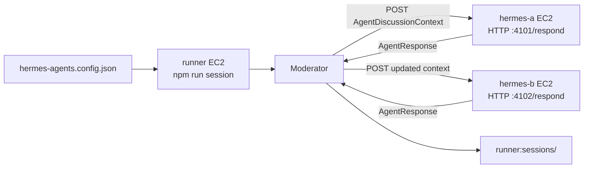

# AWS EC2 三台 VM 測試計畫：runner + hermes-a + hermes-b

這份文件說明如何用三台 AWS EC2 模擬真正的分散式 Hermes 討論：

- `runner`：負責執行 `npm run session`，讀取設定檔，啟動 moderator。
- `hermes-a`：提供 Hermes A HTTP endpoint。
- `hermes-b`：提供 Hermes B HTTP endpoint。

目標是讓 runner 呼叫 hermes-a / hermes-b，讓兩台 Hermes 針對同一個主題輪流討論，最後產生討論紀錄與任務分派。

## 1. 整體架構



## 2. EC2 建議設定

### 2.1 建議 VM

三台都可以先用：

```text
Ubuntu 22.04 或 Ubuntu 24.04
t3.micro 或 t3.small
同一個 VPC
同一個 subnet 或可互通的 private subnet
```

### 2.2 命名

建議命名：

```text
aiMeeting-runner
aiMeeting-hermes-a
aiMeeting-hermes-b
```

### 2.3 網路與 Security Group

建議三台都放同一個 security group，例如：

```text
aiMeeting-hermes-test-sg
```

Inbound rules：

```text
SSH  TCP 22    from your IP
HTTP TCP 4101  from runner private IP 或 security group self-reference
HTTP TCP 4102  from runner private IP 或 security group self-reference
```

如果三台使用同一個 security group，最簡單的內網規則是：

```text
All TCP from same security group
```

測試環境可以這樣做；正式環境再收斂成只開 `4101`、`4102`。

Outbound rules 保持預設允許即可。

### 2.4 IP 記錄

建好 EC2 後，先記錄 private IP：

```text
RUNNER_PRIVATE_IP=<runner-private-ip>
HERMES_A_PRIVATE_IP=<hermes-a-private-ip>
HERMES_B_PRIVATE_IP=<hermes-b-private-ip>
```

後續 runner 會用 private IP 呼叫 hermes-a / hermes-b。

## 3. 三台 EC2 共通前置作業

三台都先 SSH 進去，執行：

```bash
sudo apt update
sudo apt install -y git curl ca-certificates nodejs npm
node --version
npm --version
```

如果 Ubuntu apt 的 Node 版本低於 20，建議改裝 NodeSource 或 nvm。最少需求是：

```text
node >= 20
npm available
```

確認 git 可以 clone：

```bash
git --version
```

## 4. hermes-a EC2 設定與啟動

### 4.1 Clone repo

在 hermes-a EC2：

```bash
mkdir -p ~/projects
cd ~/projects
git clone https://github.com/haha1811/aiMeeting.git
cd aiMeeting
npm install
npm test
```

### 4.2 建立 Hermes A mock HTTP endpoint

目前 repo 的核心 runner 已支援 HTTP adapter；為了 EC2 測試，可以先用一個很薄的 mock HTTP endpoint 模擬 Hermes A。

建立資料夾：

```bash
mkdir -p agents
```

建立 `agents/hermes-http-mock.js`：

```bash
cat > agents/hermes-http-mock.js <<'EOF'
import http from "node:http";

const port = Number.parseInt(process.env.PORT ?? "4101", 10);
const agentId = process.env.AGENT_ID ?? "hermes-a";
const agentName = process.env.AGENT_NAME ?? "Hermes A";
const assignTo = process.env.ASSIGN_TO ?? "hermes-b";

function readJson(req) {
  return new Promise((resolve, reject) => {
    let body = "";
    req.setEncoding("utf8");
    req.on("data", (chunk) => {
      body += chunk;
    });
    req.on("end", () => {
      try {
        resolve(body ? JSON.parse(body) : {});
      } catch (error) {
        reject(error);
      }
    });
    req.on("error", reject);
  });
}

const server = http.createServer(async (req, res) => {
  if (req.method !== "POST" || req.url !== "/respond") {
    res.writeHead(404, { "content-type": "application/json" });
    res.end(JSON.stringify({ error: "not found" }));
    return;
  }

  try {
    const context = await readJson(req);
    const response = {
      content: `${agentName} received topic "${context.topic}" at round ${context.round}. I will plan the web site work and assign implementation to ${assignTo}.`,
      taskAssignments: [
        {
          assignedAgentId: assignTo,
          title: "Implement the product web site prototype",
          detail: "Create the first working version of the web site based on the discussion context.",
          confidence: 0.88,
          rationale: `${assignTo} is responsible for implementation in this test.`
        }
      ]
    };

    res.writeHead(200, { "content-type": "application/json" });
    res.end(JSON.stringify(response));
  } catch (error) {
    res.writeHead(500, { "content-type": "application/json" });
    res.end(JSON.stringify({ error: error instanceof Error ? error.message : String(error) }));
  }
});

server.listen(port, "0.0.0.0", () => {
  console.log(`${agentId} listening on 0.0.0.0:${port}/respond`);
});
EOF
```

### 4.3 啟動 Hermes A

```bash
PORT=4101 AGENT_ID=hermes-a AGENT_NAME="Hermes A" ASSIGN_TO=hermes-b node agents/hermes-http-mock.js
```

保持這個 terminal 開著。

如果你希望背景執行：

```bash
nohup env PORT=4101 AGENT_ID=hermes-a AGENT_NAME="Hermes A" ASSIGN_TO=hermes-b node agents/hermes-http-mock.js > hermes-a.log 2>&1 &
tail -f hermes-a.log
```

### 4.4 本機測試 Hermes A

在 hermes-a EC2 另開 terminal：

```bash
curl -s http://localhost:4101/respond \
  -H 'content-type: application/json' \
  -d '{"topic":"local test","round":1,"messages":[],"taskAssignments":[]}' | jq .
```

如果沒有 `jq`：

```bash
curl -s http://localhost:4101/respond \
  -H 'content-type: application/json' \
  -d '{"topic":"local test","round":1,"messages":[],"taskAssignments":[]}'
```

## 5. hermes-b EC2 設定與啟動

### 5.1 Clone repo

在 hermes-b EC2：

```bash
mkdir -p ~/projects
cd ~/projects
git clone https://github.com/haha1811/aiMeeting.git
cd aiMeeting
npm install
npm test
```

### 5.2 建立 Hermes B mock HTTP endpoint

同樣建立：

```bash
mkdir -p agents
```

建立 `agents/hermes-http-mock.js`：

```bash
cat > agents/hermes-http-mock.js <<'EOF'
import http from "node:http";

const port = Number.parseInt(process.env.PORT ?? "4102", 10);
const agentId = process.env.AGENT_ID ?? "hermes-b";
const agentName = process.env.AGENT_NAME ?? "Hermes B";
const assignTo = process.env.ASSIGN_TO ?? "hermes-a";

function readJson(req) {
  return new Promise((resolve, reject) => {
    let body = "";
    req.setEncoding("utf8");
    req.on("data", (chunk) => {
      body += chunk;
    });
    req.on("end", () => {
      try {
        resolve(body ? JSON.parse(body) : {});
      } catch (error) {
        reject(error);
      }
    });
    req.on("error", reject);
  });
}

const server = http.createServer(async (req, res) => {
  if (req.method !== "POST" || req.url !== "/respond") {
    res.writeHead(404, { "content-type": "application/json" });
    res.end(JSON.stringify({ error: "not found" }));
    return;
  }

  try {
    const context = await readJson(req);
    const response = {
      content: `${agentName} reviewed ${context.messages?.length ?? 0} previous messages. I will validate the implementation plan and assign planning follow-up to ${assignTo}.`,
      taskAssignments: [
        {
          assignedAgentId: assignTo,
          title: "Prepare web site planning checklist",
          detail: "Summarize pages, user flows, risks, and acceptance criteria for the web site.",
          confidence: 0.84,
          rationale: `${assignTo} is responsible for planning in this test.`
        }
      ]
    };

    res.writeHead(200, { "content-type": "application/json" });
    res.end(JSON.stringify(response));
  } catch (error) {
    res.writeHead(500, { "content-type": "application/json" });
    res.end(JSON.stringify({ error: error instanceof Error ? error.message : String(error) }));
  }
});

server.listen(port, "0.0.0.0", () => {
  console.log(`${agentId} listening on 0.0.0.0:${port}/respond`);
});
EOF
```

### 5.3 啟動 Hermes B

```bash
PORT=4102 AGENT_ID=hermes-b AGENT_NAME="Hermes B" ASSIGN_TO=hermes-a node agents/hermes-http-mock.js
```

背景執行版本：

```bash
nohup env PORT=4102 AGENT_ID=hermes-b AGENT_NAME="Hermes B" ASSIGN_TO=hermes-a node agents/hermes-http-mock.js > hermes-b.log 2>&1 &
tail -f hermes-b.log
```

### 5.4 本機測試 Hermes B

```bash
curl -s http://localhost:4102/respond \
  -H 'content-type: application/json' \
  -d '{"topic":"local test","round":1,"messages":[],"taskAssignments":[]}'
```

## 6. runner EC2 設定與啟動

### 6.1 Clone repo

在 runner EC2：

```bash
mkdir -p ~/projects
cd ~/projects
git clone https://github.com/haha1811/aiMeeting.git
cd aiMeeting
npm install
npm test
```

### 6.2 確認 runner 可以連到 hermes-a / hermes-b

把 IP 換成實際 private IP：

```bash
export HERMES_A_PRIVATE_IP=<hermes-a-private-ip>
export HERMES_B_PRIVATE_IP=<hermes-b-private-ip>
```

測 hermes-a：

```bash
curl -s "http://${HERMES_A_PRIVATE_IP}:4101/respond" \
  -H 'content-type: application/json' \
  -d '{"topic":"runner connectivity test","round":1,"messages":[],"taskAssignments":[]}'
```

測 hermes-b：

```bash
curl -s "http://${HERMES_B_PRIVATE_IP}:4102/respond" \
  -H 'content-type: application/json' \
  -d '{"topic":"runner connectivity test","round":1,"messages":[],"taskAssignments":[]}'
```

如果 curl 連不到，優先檢查：

- EC2 security group inbound rules。
- hermes-a 是否真的 listen `0.0.0.0:4101`。
- hermes-b 是否真的 listen `0.0.0.0:4102`。
- runner 使用的是 private IP，不是 localhost。
- 三台 EC2 是否在互通的 VPC/subnet。

### 6.3 建立 runner 的 HTTP 設定檔

在 runner EC2 的 repo 目錄：

```bash
cat > hermes-agents.aws.config.json <<EOF
{
  "topic": "Web 站台開發：規劃一個產品介紹網站的 MVP",
  "maxRounds": 3,
  "rootDir": "sessions",
  "agents": [
    {
      "id": "hermes-a",
      "name": "Hermes A",
      "role": "planner",
      "type": "http",
      "url": "http://${HERMES_A_PRIVATE_IP}:4101/respond",
      "timeoutMs": 60000
    },
    {
      "id": "hermes-b",
      "name": "Hermes B",
      "role": "builder",
      "type": "http",
      "url": "http://${HERMES_B_PRIVATE_IP}:4102/respond",
      "timeoutMs": 60000
    }
  ]
}
EOF
```

確認：

```bash
cat hermes-agents.aws.config.json
```

## 7. 模擬情境：Web 站台開發討論

### 7.1 主題

本次測試主題：

```text
Web 站台開發：規劃一個產品介紹網站的 MVP
```

預期討論內容：

- Hermes A 扮演 planner，提出網站 MVP 的方向。
- Hermes B 扮演 builder，根據 Hermes A 的 context 回覆實作與驗證方向。
- Moderator 收集發言與任務分派。
- 最終輸出 result.json。

### 7.2 在 runner 啟動討論

在 runner EC2：

```bash
npm run session -- --config hermes-agents.aws.config.json
```

成功時會看到：

```json
{
  "status": "completed",
  "topic": "Web 站台開發：規劃一個產品介紹網站的 MVP",
  "messageCount": 2,
  "taskAssignmentCount": 2,
  "files": {
    "messages": "sessions/<sessionId>/messages.jsonl",
    "events": "sessions/<sessionId>/events.jsonl",
    "session": "sessions/<sessionId>/session.json",
    "result": "sessions/<sessionId>/result.json"
  }
}
```

實際 `messageCount` 可能依停止條件而不同。

### 7.3 查看討論紀錄

把 `<sessionId>` 換成實際輸出的 session id：

```bash
cat sessions/<sessionId>/messages.jsonl
```

查看最終任務分派：

```bash
cat sessions/<sessionId>/result.json
```

查看事件：

```bash
cat sessions/<sessionId>/events.jsonl
```

## 8. 三台 EC2 的先後順序

建議順序：

1. 建立三台 EC2。
2. 設定 security group，確保 runner 可以連到 hermes-a:4101 與 hermes-b:4102。
3. 在 hermes-a 安裝環境、clone repo、建立 endpoint、啟動 `:4101/respond`。
4. 在 hermes-b 安裝環境、clone repo、建立 endpoint、啟動 `:4102/respond`。
5. 在 runner 安裝環境、clone repo、跑 `npm test`。
6. 在 runner 用 curl 測 hermes-a / hermes-b endpoint。
7. 在 runner 建立 `hermes-agents.aws.config.json`。
8. 在 runner 執行 `npm run session -- --config hermes-agents.aws.config.json`。
9. 在 runner 查看 `sessions/<sessionId>/messages.jsonl` 與 `result.json`。
10. 依結果調整真實 Hermes agent response contract。

## 9. 驗收標準

測試成功需要符合：

- runner 可以 curl 到 hermes-a。
- runner 可以 curl 到 hermes-b。
- `npm test` 通過。
- `npm run session -- --config hermes-agents.aws.config.json` 回傳 `status: completed`。
- `sessions/<sessionId>/messages.jsonl` 至少有 hermes-a 與 hermes-b 的回覆。
- `sessions/<sessionId>/result.json` 有 task assignments。

## 10. 常見問題排查

### 10.1 runner curl 不到 hermes-a 或 hermes-b

檢查：

```bash
curl -v http://<hermes-private-ip>:4101/respond
curl -v http://<hermes-private-ip>:4102/respond
```

可能原因：

- Security group 沒開 port。
- Hermes endpoint 沒啟動。
- Endpoint 只 listen `127.0.0.1`，沒有 listen `0.0.0.0`。
- 用錯 public IP / private IP。
- EC2 不在互通的 network。

### 10.2 session 失敗，顯示 HTTP agent failed

檢查 Hermes endpoint response：

```bash
curl -s http://<hermes-private-ip>:<port>/respond \
  -H 'content-type: application/json' \
  -d '{"topic":"debug","round":1,"messages":[],"taskAssignments":[]}'
```

Endpoint 應回傳 JSON：

```json
{
  "content": "some response",
  "taskAssignments": []
}
```

### 10.3 沒有 task assignments

如果 agent 只回：

```json
{ "content": "hello" }
```

討論仍會成功，但任務分派會比較少。若要明確分工，請讓 Hermes 回傳：

```json
{
  "content": "I recommend the next action.",
  "taskAssignments": [
    {
      "assignedAgentId": "hermes-b",
      "title": "Implement MVP",
      "detail": "Build the first working page."
    }
  ]
}
```

### 10.4 要不要在 hermes-a / hermes-b 也跑 runner？

不需要。

三台架構中：

- runner 只負責協調。
- hermes-a 只負責提供 `/respond`。
- hermes-b 只負責提供 `/respond`。

這樣最容易觀察與除錯。

## 11. 下一步：換成真實 Hermes

當 mock HTTP endpoint 測通後，把 hermes-a / hermes-b 的 `agents/hermes-http-mock.js` 換成真實 Hermes service。

只要真實 service 遵守：

```text
POST /respond
request body: AgentDiscussionContext JSON
response body: AgentResponse JSON or plain text
```

runner 的 `hermes-agents.aws.config.json` 就不需要大改，只要更新 endpoint URL 或 headers。

