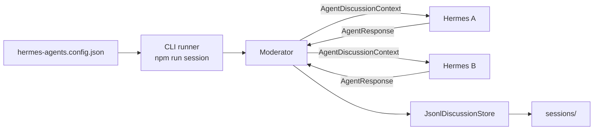
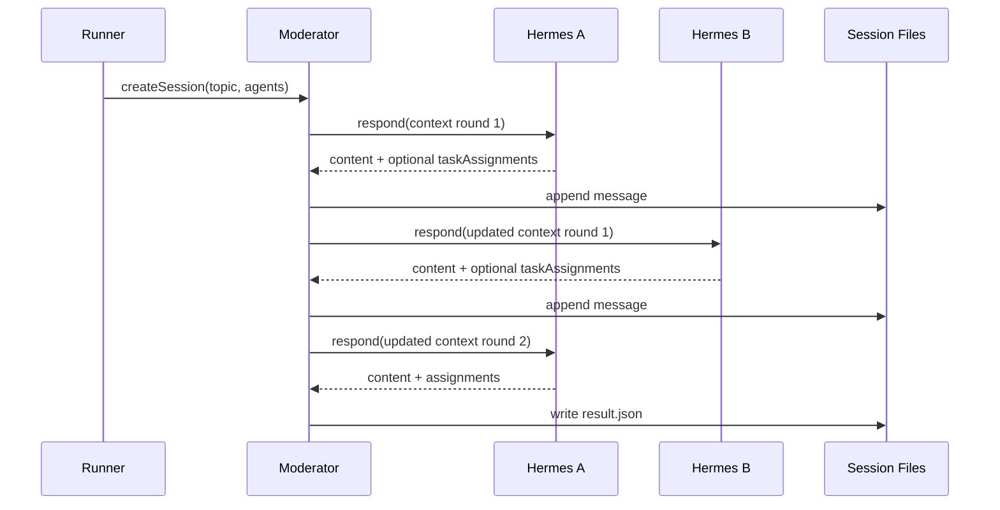
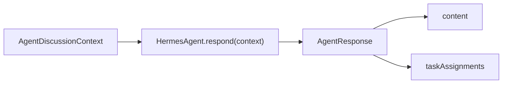

# Hermes Agent Self-Setup Guide

This document is written for a Hermes agent or automation agent that needs to set up, verify, and use this repository without human hand-holding.

## Mission

This repository provides a TypeScript/Node core module for moderated multi-agent discussions.

Your job as a Hermes agent is to:

1. Set up the runtime.
2. Verify the project works.
3. Understand the public API.
4. Create or adapt Hermes agent instances that implement `HermesAgent`.
5. Run a discussion session and inspect the output files.

## Repository

GitHub repository:

```text
git@github.com:haha1811/aiMeeting.git
```

Recommended WSL working directory:

```bash
~/projects/aiMeeting
```

Primary implementation files:

```text
src/types.ts
src/service.ts
src/moderator.ts
src/storage.ts
src/index.ts
```

Primary test file:

```text
test/discussion-service.test.ts
```

Runnable discussion config:

```text
hermes-agents.config.json
```

Config template:

```text
hermes-agents.config.example.json
```

Detailed human operations guide:

```text
docs/OPERATIONS.md
```

## System Overview



## Required Runtime

Use Node.js 20 or newer.

Current known-good WSL runtime:

```bash
/home/haha/.local/node/node-v22.22.2-linux-x64/bin/node
/home/haha/.local/node/node-v22.22.2-linux-x64/bin/npm
```

If this runtime exists, activate it in the current shell:

```bash
export PATH=/home/haha/.local/node/node-v22.22.2-linux-x64/bin:$PATH
```

Verify:

```bash
node --version
npm --version
```

Expected minimum:

```text
node >= 20
npm available
```

## Fresh Clone Setup

If the repository is not present locally:

```bash
mkdir -p ~/projects
cd ~/projects
git clone git@github.com:haha1811/aiMeeting.git
cd aiMeeting
```

If the repository already exists:

```bash
cd ~/projects/aiMeeting
git pull
```

Install dependencies:

```bash
npm install
```

Run the verification suite:

```bash
npm test
```

Run the default `hermes-a` / `hermes-b` mock discussion:

```bash
npm run session
```

Success criteria:

```text
tests 9
pass 9
fail 0
```

For `npm run session`, success means the command prints JSON with status `completed`, output file paths, and task assignments. The exact message and assignment counts may change after editing `hermes-agents.config.json`.

## Agent Configuration

Hermes agents configure themselves in:

```text
hermes-agents.config.json
```

Minimum shape:

```json
{
  "topic": "Discussion topic",
  "maxRounds": 3,
  "rootDir": "sessions",
  "agents": [
    {
      "id": "hermes-a",
      "name": "Hermes A",
      "role": "planner",
      "type": "mock",
      "responses": [{ "content": "I am ready." }]
    },
    {
      "id": "hermes-b",
      "name": "Hermes B",
      "role": "builder",
      "type": "mock",
      "responses": [{ "content": "I am ready too." }]
    }
  ]
}
```

Rules:

- `agents` must contain at least two agents.
- Each `id` must be unique.
- `id` is the value used by task assignments.
- Agent order controls moderator turn order.
- `maxRounds` controls the maximum number of rounds.

## Supported Agent Adapter Types

### mock

Use `mock` when verifying the system or creating a deterministic demo.

```json
{
  "id": "hermes-a",
  "name": "Hermes A",
  "role": "planner",
  "type": "mock",
  "responses": [
    {
      "content": "I will assign work to Hermes B.",
      "taskAssignments": [
        {
          "assignedAgentId": "hermes-b",
          "title": "Prepare implementation approach",
          "detail": "Propose the implementation path."
        }
      ]
    }
  ]
}
```

### command

Use `command` when a Hermes agent can be called as a local executable.

The discussion runner sends `AgentDiscussionContext` as JSON to stdin. The command must print either JSON matching `AgentResponse` or plain text. Plain text is treated as `{ "content": "<stdout>" }`.

```json
{
  "id": "hermes-a",
  "name": "Hermes A",
  "role": "planner",
  "type": "command",
  "command": "node",
  "args": ["./agents/hermes-a.js"],
  "timeoutMs": 60000
}
```

Command agent contract:

```text
stdin:  AgentDiscussionContext JSON
stdout: AgentResponse JSON or plain text
exit:   0 on success
```

Example stdout:

```json
{
  "content": "I recommend Hermes B implements the runner.",
  "taskAssignments": [
    {
      "assignedAgentId": "hermes-b",
      "title": "Implement runner",
      "detail": "Create the script that starts the configured discussion."
    }
  ]
}
```

### http

Use `http` when a Hermes agent exposes an HTTP endpoint.

The discussion runner sends `AgentDiscussionContext` as a JSON POST body. The endpoint must return either JSON matching `AgentResponse` or plain text.

```json
{
  "id": "hermes-b",
  "name": "Hermes B",
  "role": "builder",
  "type": "http",
  "url": "http://localhost:4102/respond",
  "headers": {
    "authorization": "Bearer local-token"
  },
  "timeoutMs": 60000
}
```

## How Hermes A And Hermes B Start Talking

1. Each Hermes agent reads this guide.
2. Each Hermes agent ensures it has an entry in `hermes-agents.config.json`.
3. Each real agent chooses either `command` or `http` as its adapter.
4. Each real agent verifies it can receive `AgentDiscussionContext` and return `AgentResponse`.
5. One runner process executes:

```bash
npm run session
```

The runner creates the session, the moderator calls `hermes-a`, then `hermes-b`, and continues until `maxRounds` or the assignment completion condition is reached.

Hermes agents do not call each other directly in v1. They communicate through the moderated session context.



If `npm test` fails because `node` or `npm` is missing, activate the WSL user-local Node runtime:

```bash
export PATH=/home/haha/.local/node/node-v22.22.2-linux-x64/bin:$PATH
npm test
```

## Core Concepts

### HermesAgent

Every participating agent must implement this interface:

```ts
export interface HermesAgent {
  id: string;
  name: string;
  role?: string;
  respond(context: AgentDiscussionContext): Promise<AgentResponse>;
}
```

The `respond(context)` method is the integration point between this discussion core and the actual Hermes runtime.

### AgentDiscussionContext

The moderator passes context into each agent on every turn.



Important fields:

```ts
{
  sessionId: string;
  topic: string;
  round: number;
  speaker: AgentDescriptor;
  agents: AgentDescriptor[];
  messages: DiscussionMessage[];
  taskAssignments: TaskAssignment[];
}
```

Use `context.messages` to understand the discussion so far.

Use `context.taskAssignments` to avoid duplicate assignments.

Use `context.round` to adjust behavior across turns.

### AgentResponse

Each agent response should return:

```ts
{
  content: string;
  taskAssignments?: TaskAssignmentInput[];
}
```

`content` is the natural-language discussion message.

`taskAssignments` is optional, but recommended when the agent can identify concrete next actions.

### Task Assignment Shape

Use this structure when assigning work:

```ts
{
  assignedAgentId: "builder",
  title: "Implement moderator loop",
  detail: "Add deterministic turn control and maxRounds stop condition.",
  dependencies: ["Define HermesAgent interface"],
  confidence: 0.87,
  rationale: "The builder agent owns implementation work."
}
```

Rules:

- `assignedAgentId` must match one of the session agents.
- `title` should be short and action-oriented.
- `detail` should be specific enough for execution.
- `dependencies`, `confidence`, and `rationale` are optional.

## Runner Workspace Ownership

All file outputs are created and verified on the runner, not on the Hermes agent host.

```text
Hermes agent
  -> returns actions JSON
  -> runner executes actions
  -> runner writes workspaces/<sessionId>/repo
```

Hermes A and Hermes B should not inspect their local filesystem to validate generated files. Their local EC2 instances only run the wrapper and Hermes CLI. They do not contain the runner workspace.

If an agent needs to create or inspect files, it must return actions:

```json
{
  "actions": [
    {
      "type": "read_file",
      "path": "docs/web-mvp-plan.md"
    },
    {
      "type": "run_command",
      "command": "ls",
      "args": ["docs"]
    }
  ]
}
```

The next turn receives runner execution output through `executionResults`. Agents should use `executionResults` to decide whether the file exists, whether a command succeeded, and what follow-up action is needed.

## Running a Session

Minimal example:

```ts
import { DiscussionService, type HermesAgent } from "./src/index.js";

const planner: HermesAgent = {
  id: "planner",
  name: "Planner",
  role: "planning",
  async respond(context) {
    return {
      content: `I will plan work for: ${context.topic}`,
      taskAssignments: [
        {
          assignedAgentId: "builder",
          title: "Build the requested feature",
          detail: "Implement the feature according to the discussion result.",
          confidence: 0.85
        }
      ]
    };
  }
};

const builder: HermesAgent = {
  id: "builder",
  name: "Builder",
  role: "implementation",
  async respond() {
    return {
      content: "I can implement the assigned work."
    };
  }
};

const service = new DiscussionService({ rootDir: "sessions" });

const session = await service.createSession({
  topic: "Plan the next implementation step",
  agents: [planner, builder],
  maxRounds: 3
});

const result = await service.runSession(session.sessionId);

console.log(result);
```

## Adapting a Real Hermes Runtime

Wrap the real Hermes call inside `respond(context)`.

Template:

```ts
const hermesAgent: HermesAgent = {
  id: "hermes-planner",
  name: "Hermes Planner",
  role: "planning",
  async respond(context) {
    const prompt = [
      `Topic: ${context.topic}`,
      `Round: ${context.round}`,
      "Agents:",
      ...context.agents.map((agent) => `- ${agent.id}: ${agent.name} (${agent.role ?? "no role"})`),
      "Messages so far:",
      ...context.messages.map((message) => `${message.senderName}: ${message.content}`),
      "Existing task assignments:",
      JSON.stringify(context.taskAssignments, null, 2),
      "Return a JSON object with content and optional taskAssignments."
    ].join("\n");

    const hermesOutput = await callHermesRuntime(prompt);

    return {
      content: hermesOutput.content,
      taskAssignments: hermesOutput.taskAssignments
    };
  }
};
```

Expected Hermes runtime response:

```json
{
  "content": "I recommend implementing the session runner first.",
  "taskAssignments": [
    {
      "assignedAgentId": "builder",
      "title": "Implement session runner",
      "detail": "Create a script that instantiates agents and calls runSession.",
      "confidence": 0.9,
      "rationale": "A runnable session proves the integration works."
    }
  ]
}
```

If the real Hermes runtime returns plain text instead of JSON, convert it into:

```ts
{
  content: hermesText,
  taskAssignments: []
}
```

## Moderator Behavior

The moderator:

1. Requires at least two agents.
2. Runs agents in the order passed to `createSession`.
3. Passes the latest messages and assignments into every turn.
4. Stops when `maxRounds` is reached.
5. Stops early when every agent has at least one task assignment.
6. Writes missing follow-up assignments if the discussion ends without assigning every agent.

Do not assume free-form peer-to-peer messaging in v1. The model is a moderated meeting room.

## Output Files

Each session writes files under:

```text
sessions/<sessionId>/
```

Files:

```text
messages.jsonl
events.jsonl
session.json
result.json
```

Inspect the transcript:

```bash
cat sessions/<sessionId>/messages.jsonl
```

Inspect lifecycle events:

```bash
cat sessions/<sessionId>/events.jsonl
```

Inspect final task assignments:

```bash
cat sessions/<sessionId>/result.json
```

## Self-Check Procedure

Before making code changes:

```bash
git status --short
npm test
```

After making code changes:

```bash
npm test
git status --short
```

Expected test result:

```text
pass 9
fail 0
```

If tests fail, inspect:

```bash
test/discussion-service.test.ts
src/service.ts
src/moderator.ts
src/storage.ts
src/types.ts
```

## Git Workflow

Use the normal SSH remote:

```bash
git remote -v
```

Expected:

```text
origin  git@github.com:haha1811/aiMeeting.git (fetch)
origin  git@github.com:haha1811/aiMeeting.git (push)
```

Commit and push:

```bash
git add .
git commit -m "Describe the change"
git push
```

If SSH fails, test:

```bash
ssh -T git@github.com
```

Expected:

```text
Hi haha1811! You've successfully authenticated, but GitHub does not provide shell access.
```

## Safe Defaults

When uncertain:

- Use `DiscussionService` as the public entrypoint.
- Keep agents in the same Node process.
- Use `maxRounds: 3`.
- Store outputs in `sessions`.
- Return structured `taskAssignments` whenever possible.
- Run `npm test` before committing.

## Do Not Do This In v1

- Do not implement direct private messages between agents.
- Do not introduce a database.
- Do not require a browser UI.
- Do not assume remote HTTP/WebSocket agents are already supported.
- Do not write generated `dist`, `node_modules`, or `sessions` output into git.

