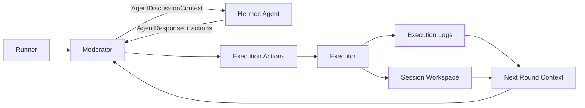
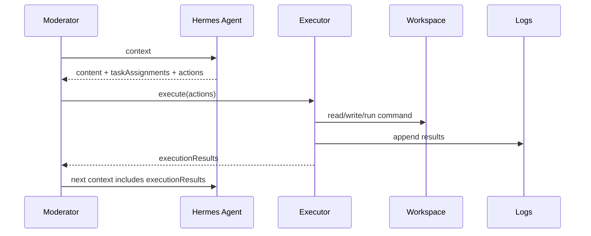

# Phase 2 Execution Design：AI Autonomous Execution System

本文件定義 Phase 2 的設計方向：讓 Hermes agents 從「可以討論與規劃」升級成「可以提出可執行動作，並由 runner 安全執行」。

Phase 1 已完成：

```text
AI Team Discussion System
```

Phase 2 目標：

```text
AI Autonomous Execution System
```

## 1. Phase 2 目標

Phase 2 要讓 Hermes agents 不只回覆自然語言，也能回傳 structured actions。

Runner 收到 actions 後，透過 executor 執行：

- 讀檔
- 寫檔
- 建立資料夾
- 執行 shell command
- 執行 npm test / build
- git status / diff / commit

執行結果會回寫到下一輪 `AgentDiscussionContext`，讓後續 agent 可以根據實際結果修正行動。

## 2. 非目標

Phase 2 v1 暫不做：

- 任意 unrestricted shell 權限。
- 自動部署 production。
- 自動 merge PR。
- 跨 workspace 任意讀寫。
- agent 直接互相 SSH。
- agent 直接操作 GitHub token。
- browser UI。

Phase 2 v1 的重點是：

```text
可控、可記錄、可回放、可驗證的 execution loop
```

## 3. 高階架構



## 4. Workspace 設計

每次 session 建立獨立 workspace：

```text
workspaces/<sessionId>/
```

workspace 內建議結構：

```text
workspaces/<sessionId>/
  repo/
  artifacts/
  execution/
    actions.jsonl
    results.jsonl
    stdout/
    stderr/
```

說明：

- `repo/`：agent 實際修改的專案工作區。
- `artifacts/`：產出物，例如截圖、報告、build output summary。
- `execution/actions.jsonl`：每個 agent 提出的 action。
- `execution/results.jsonl`：executor 執行結果。
- `stdout/`、`stderr/`：長輸出檔案。

### Workspace 原則

- 所有 file write 必須限制在 `workspaces/<sessionId>/repo/` 內。
- executor 不可寫出 workspace 之外。
- 讀檔可先限制在 workspace 內，後續再設計 allowlist。
- shell command 預設 cwd 為 `workspaces/<sessionId>/repo/`。

## 5. Agent Action Schema

Phase 2 要擴充 `AgentResponse`。

目前：

```ts
export interface AgentResponse {
  content: string;
  taskAssignments?: TaskAssignmentInput[];
}
```

Phase 2 建議新增：

```ts
export interface AgentResponse {
  content: string;
  taskAssignments?: TaskAssignmentInput[];
  actions?: ExecutionActionInput[];
}
```

## 6. ExecutionActionInput

建議 v1 支援以下 action：

```ts
export type ExecutionActionInput =
  | ReadFileAction
  | WriteFileAction
  | MakeDirectoryAction
  | RunCommandAction
  | GitStatusAction
  | GitDiffAction
  | GitCommitAction;
```

### 6.1 read_file

```json
{
  "type": "read_file",
  "path": "package.json"
}
```

用途：

- 讓 agent 讀取 workspace 內檔案。
- 結果回寫到 execution result。

限制：

- `path` 必須是 workspace 相對路徑。
- 不允許 `..` 逃出 workspace。

### 6.2 write_file

```json
{
  "type": "write_file",
  "path": "src/App.tsx",
  "content": "export default function App() { return <div>Hello</div>; }"
}
```

用途：

- 建立或覆蓋檔案。

限制：

- 只能寫 workspace。
- 預設覆蓋整個檔案。
- 後續可加入 patch action。

### 6.3 mkdir

```json
{
  "type": "mkdir",
  "path": "src/components"
}
```

用途：

- 建立資料夾。

### 6.4 run_command

```json
{
  "type": "run_command",
  "command": "npm",
  "args": ["test"],
  "timeoutMs": 120000
}
```

用途：

- 執行測試、build、lint、package install。

限制：

- `command` 先採 allowlist。
- v1 allowlist 建議：

```text
npm
node
git
ls
cat
pwd
mkdir
cp
```

- 不允許：

```text
rm -rf /
sudo
ssh
scp
curl arbitrary external
wget arbitrary external
chmod 777
```

### 6.5 git_status

```json
{
  "type": "git_status"
}
```

等價：

```bash
git status --short
```

### 6.6 git_diff

```json
{
  "type": "git_diff"
}
```

等價：

```bash
git diff
```

### 6.7 git_commit

```json
{
  "type": "git_commit",
  "message": "Implement MVP landing page"
}
```

用途：

- 將 workspace 內變更 commit。

限制：

- v1 不自動 push。
- v1 不自動開 PR。
- commit 前 executor 應先產生 git diff summary。

## 7. Execution Result Schema

每個 action 執行後產生 result：

```ts
export interface ExecutionResult {
  id: string;
  actionId: string;
  sessionId: string;
  agentId: string;
  status: "succeeded" | "failed" | "skipped";
  startedAt: string;
  completedAt: string;
  summary: string;
  exitCode?: number;
  stdoutPath?: string;
  stderrPath?: string;
  outputPreview?: string;
  error?: string;
}
```

原則：

- 長 stdout/stderr 寫檔。
- context 只帶 summary 與短 preview。
- 完整輸出可從 `execution/stdout/`、`execution/stderr/` 查。

## 8. Context 擴充

目前 `AgentDiscussionContext` 包含：

```ts
messages
taskAssignments
```

Phase 2 建議新增：

```ts
executionResults?: ExecutionResult[];
workspace?: {
  root: string;
  repoPath: string;
};
```

下一輪 agent 可看到：

- 上一輪誰執行了什麼 action。
- 成功或失敗。
- stdout/stderr summary。
- 目前 workspace 狀態。

## 9. Execution Loop



## 10. Safety Rules

Phase 2 v1 executor 必須遵守：

- 所有 path 都 normalize 並驗證在 workspace 內。
- shell command 預設 disable shell interpolation，使用 `spawn(command, args)`。
- command 採 allowlist。
- timeout 預設 120 秒。
- stdout/stderr 限制 preview 長度。
- actions/results 全部 append-only 記錄。
- destructive action 預設不支援。
- push/deploy 預設不支援。

## 11. MVP 使用情境：Web 站台開發

主題：

```text
請 Hermes A 與 Hermes B 共同完成一個產品介紹網站 MVP。
```

角色：

```text
Hermes A：planner，負責需求、頁面架構、驗收標準。
Hermes B：builder，負責建立檔案、執行測試、修正錯誤。
```

期望流程：

1. Hermes A 討論並產生任務。
2. Hermes B 回傳 `write_file` actions 建立網站。
3. Executor 寫入 workspace。
4. Hermes B 回傳 `run_command npm test` 或 `npm build`。
5. Executor 執行並回寫結果。
6. Hermes A 根據結果做 review。
7. Hermes B 修正。
8. 最終 git diff / result.json 顯示交付內容。

## 12. Phase 2 v1 實作順序

建議順序：

1. 定義 execution types。
2. 新增 workspace manager。
3. 新增 executor。
4. 擴充 `AgentResponse.actions`。
5. 擴充 `AgentDiscussionContext.executionResults`。
6. 修改 moderator：agent 回覆後執行 actions。
7. 新增 execution JSONL persistence。
8. 新增測試：path safety、write_file、run_command、result propagation。
9. 新增 `npm run session:execute` 或 config flag。
10. 用 mock agent 完成 Web MVP 寫檔測試。
11. 再接真實 Hermes agent。

## 13. Phase 2 v1 驗收標準

Phase 2 v1 完成時，應能：

- 建立 isolated workspace。
- agent 回傳 `actions`。
- executor 執行 `write_file`。
- executor 執行 allowlisted `run_command`。
- execution results 寫入 JSONL。
- 下一輪 agent 可以看到 execution results。
- 測試覆蓋 path escape 防護。
- mock agent 可產生一個簡單 Web MVP 檔案。
- `npm test` 通過。

## 14. Phase 2 Smoke Test

目前 repo 提供一個 mock execution smoke test：

```bash
npm run session:execute
```

此指令會讀取：

```text
hermes-agents.execution.config.json
```

並啟用：

```json
{
  "enableExecution": true,
  "workspaceRootDir": "workspaces"
}
```

預期行為：

- 建立 `workspaces/<sessionId>/repo/`
- Hermes A 透過 action 建立 `docs/web-mvp.md`
- Hermes B 透過 action 執行 `ls docs`
- runner 產生 `actions.jsonl`
- runner 產生 `execution-results.jsonl`
- result JSON 顯示 `executionResultCount`

## 15. Open Questions

後續實作前需要決定：

- workspace 要 clone 哪個 repo，還是建立空 repo？
- Phase 2 v1 是否允許 `npm install`？
- 是否需要 human approval gate？
- 是否需要每個 agent 有不同 action 權限？
- git commit 是否由 executor 自動做，還是只產生 diff？
- 真實 Hermes 要回 JSON actions，還是由 wrapper 將自然語言轉 actions？

## 16. 建議預設決策

為了先做出可驗證 MVP，建議：

- workspace 先建立空 repo。
- 允許 `npm install`，但只在 workspace 內。
- 不做 human approval gate，但保留設計位置。
- 所有 agent 權限相同。
- v1 只做到 git diff，不自動 push。
- 真實 Hermes 必須回 JSON actions；wrapper 不負責猜測自然語言。
