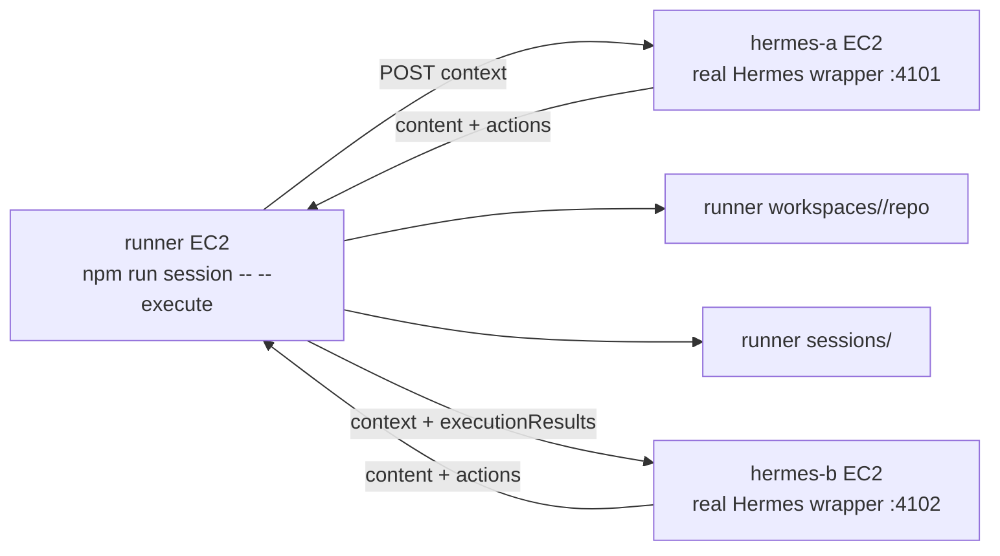

# Phase 2 Real Hermes Execution Runbook（三台 EC2）

這份文件用於既有 AWS 三台 EC2 環境，目標是驗證：

```text
real Hermes agent
→ 產生 JSON actions
→ runner 執行 actions
→ execution results 回寫 context
→ Hermes 下一輪根據結果繼續協作
```

本文件不詳細說明 AWS EC2 / VPC / Security Group 建置，假設你已經有：

```text
runner EC2
hermes-a EC2
hermes-b EC2
```

並且 runner 可以透過 private IP 連到：

```text
hermes-a:4101
hermes-b:4102
```

## 0. 本階段目標

Phase 1 已驗證：

```text
真實 Hermes A / Hermes B 可以多輪討論
```

Phase 2 已驗證：

```text
mock agent 可以回傳 actions，runner 可以執行 actions
```

本 runbook 要驗證：

```text
真實 Hermes A / Hermes B 可以回傳 actions，
runner 可以在 workspace 內執行，
下一輪 Hermes 可以讀到 execution results。
```

## 1. 三台 EC2 角色



## 2. 重要限制

目前 Phase 2 executor 已支援：

- `mkdir`
- `write_file`
- `read_file`
- `run_command`
- `git_status`
- `git_diff`
- `git_commit`

但本次 real Hermes 驗證建議只先用：

- `mkdir`
- `write_file`
- `run_command`

不要一開始就做：

- deploy
- push
- PR
- 大型 npm install
- 任意 shell script

## 3. 共通前置檢查（三台都做）

三台 EC2 都先確認 repo 與 Node：

```bash
cd ~/projects/aiMeeting
git pull
node --version
npm --version
npm install
```

在三台都跑：

```bash
npm test
```

預期：

```text
tests 13
pass 13
fail 0
```

如果 Node 找不到，依你的環境啟用 Node。若使用先前 WSL/local 風格：

```bash
export PATH=/home/haha/.local/node/node-v22.22.2-linux-x64/bin:$PATH
```

EC2 若用 apt/nvm 安裝 Node，依實際路徑調整。

## 4. hermes-a EC2 設定

### 4.1 確認 Hermes CLI

在 hermes-a EC2：

```bash
which hermes
hermes --version
hermes chat "請用繁體中文簡短回答：Hermes A 可以正常回覆嗎？"
```

預期：

- 找得到 `hermes`
- version 正常
- 可以得到中文回覆

### 4.2 確認 real wrapper 存在

```bash
cd ~/projects/aiMeeting
ls agents/hermes-http-real.js
node --check agents/hermes-http-real.js
```

### 4.3 啟動 hermes-a real wrapper

建議先用 foreground 啟動，方便看 log：

```bash
cd ~/projects/aiMeeting
PORT=4101 \
AGENT_ID=hermes-a \
AGENT_NAME="Hermes A" \
AGENT_ROLE="planner" \
HERMES_TIMEOUT_MS=300000 \
node agents/hermes-http-real.js
```

預期 log：

```text
hermes-a real Hermes wrapper listening on 0.0.0.0:4101/respond
```

保持 terminal 開著。

### 4.4 hermes-a 本機 curl 測試

另開 hermes-a terminal：

```bash
curl -s http://localhost:4101/respond \
  -H 'content-type: application/json' \
  -d '{
    "sessionId":"local-test",
    "topic":"Phase 2 real Hermes action test",
    "round":1,
    "speaker":{"id":"hermes-a","name":"Hermes A","role":"planner"},
    "agents":[
      {"id":"hermes-a","name":"Hermes A","role":"planner"},
      {"id":"hermes-b","name":"Hermes B","role":"builder"}
    ],
    "messages":[],
    "taskAssignments":[],
    "executionResults":[],
    "workspace":{"root":"workspaces/local-test","repoPath":"workspaces/local-test/repo"}
  }'
```

預期：

```json
{
  "content": "...",
  "taskAssignments": [],
  "actions": []
}
```

注意：目前 `agents/hermes-http-real.js` 會嘗試解析 Hermes 回覆。如果 Hermes 只回純文字，wrapper 會 fallback 成 `content`。本階段要逐步把 prompt 調整到穩定回 JSON actions。

## 5. hermes-b EC2 設定

### 5.1 確認 Hermes CLI

在 hermes-b EC2：

```bash
which hermes
hermes --version
hermes chat "請用繁體中文簡短回答：Hermes B 可以正常回覆嗎？"
```

### 5.2 確認 real wrapper

```bash
cd ~/projects/aiMeeting
ls agents/hermes-http-real.js
node --check agents/hermes-http-real.js
```

### 5.3 啟動 hermes-b real wrapper

```bash
cd ~/projects/aiMeeting
PORT=4102 \
AGENT_ID=hermes-b \
AGENT_NAME="Hermes B" \
AGENT_ROLE="builder" \
HERMES_TIMEOUT_MS=300000 \
node agents/hermes-http-real.js
```

預期 log：

```text
hermes-b real Hermes wrapper listening on 0.0.0.0:4102/respond
```

### 5.4 hermes-b 本機 curl 測試

另開 hermes-b terminal：

```bash
curl -s http://localhost:4102/respond \
  -H 'content-type: application/json' \
  -d '{
    "sessionId":"local-test",
    "topic":"Phase 2 real Hermes action test",
    "round":1,
    "speaker":{"id":"hermes-b","name":"Hermes B","role":"builder"},
    "agents":[
      {"id":"hermes-a","name":"Hermes A","role":"planner"},
      {"id":"hermes-b","name":"Hermes B","role":"builder"}
    ],
    "messages":[
      {"senderId":"hermes-a","senderName":"Hermes A","content":"請建立 Web MVP 計畫。"}
    ],
    "taskAssignments":[],
    "executionResults":[],
    "workspace":{"root":"workspaces/local-test","repoPath":"workspaces/local-test/repo"}
  }'
```

預期：

```json
{
  "content": "...",
  "taskAssignments": [],
  "actions": []
}
```

## 6. runner EC2 設定

### 6.1 確認 repo 與測試

在 runner EC2：

```bash
cd ~/projects/aiMeeting
git pull
npm install
npm test
```

預期：

```text
tests 13
pass 13
fail 0
```

### 6.2 設定 private IP

在 runner EC2：

```bash
export HERMES_A_PRIVATE_IP=<hermes-a-private-ip>
export HERMES_B_PRIVATE_IP=<hermes-b-private-ip>
```

範例：

```bash
export HERMES_A_PRIVATE_IP=10.100.1.21
export HERMES_B_PRIVATE_IP=10.100.1.32
```

### 6.3 runner curl 測 hermes-a

```bash
curl -s "http://${HERMES_A_PRIVATE_IP}:4101/respond" \
  -H 'content-type: application/json' \
  -d '{
    "sessionId":"runner-connectivity-test",
    "topic":"Runner connectivity test",
    "round":1,
    "speaker":{"id":"hermes-a","name":"Hermes A","role":"planner"},
    "agents":[
      {"id":"hermes-a","name":"Hermes A","role":"planner"},
      {"id":"hermes-b","name":"Hermes B","role":"builder"}
    ],
    "messages":[],
    "taskAssignments":[],
    "executionResults":[],
    "workspace":{"root":"workspaces/runner-connectivity-test","repoPath":"workspaces/runner-connectivity-test/repo"}
  }'
```

### 6.4 runner curl 測 hermes-b

```bash
curl -s "http://${HERMES_B_PRIVATE_IP}:4102/respond" \
  -H 'content-type: application/json' \
  -d '{
    "sessionId":"runner-connectivity-test",
    "topic":"Runner connectivity test",
    "round":1,
    "speaker":{"id":"hermes-b","name":"Hermes B","role":"builder"},
    "agents":[
      {"id":"hermes-a","name":"Hermes A","role":"planner"},
      {"id":"hermes-b","name":"Hermes B","role":"builder"}
    ],
    "messages":[
      {"senderId":"hermes-a","senderName":"Hermes A","content":"請規劃 Web MVP。"}
    ],
    "taskAssignments":[],
    "executionResults":[],
    "workspace":{"root":"workspaces/runner-connectivity-test","repoPath":"workspaces/runner-connectivity-test/repo"}
  }'
```

如果 curl 失敗，先不要跑 session。先修：

- port 是否 listen
- private IP 是否正確
- security group 是否允許 runner 連 4101 / 4102
- wrapper terminal 是否有錯誤 log

## 7. 建立 Phase 2 real execution config

在 runner EC2：

```bash
cd ~/projects/aiMeeting
cat > hermes-agents.real-execution.config.json <<EOF
{
  "topic": "請 Hermes A 與 Hermes B 共同完成一個產品介紹網站 MVP 的最小可執行雛形。Hermes A 負責規劃，Hermes B 負責產生可執行 actions。請先建立 docs/web-mvp-plan.md，內容包含網站目標、頁面區塊、技術選型、開發任務與驗收標準。接著用 run_command 檢查 docs 目錄。",
  "maxRounds": 2,
  "rootDir": "sessions",
  "enableExecution": true,
  "workspaceRootDir": "workspaces",
  "agents": [
    {
      "id": "hermes-a",
      "name": "Hermes A",
      "role": "planner",
      "type": "http",
      "url": "http://${HERMES_A_PRIVATE_IP}:4101/respond",
      "timeoutMs": 300000
    },
    {
      "id": "hermes-b",
      "name": "Hermes B",
      "role": "builder",
      "type": "http",
      "url": "http://${HERMES_B_PRIVATE_IP}:4102/respond",
      "timeoutMs": 300000
    }
  ]
}
EOF
```

確認：

```bash
cat hermes-agents.real-execution.config.json
```

## 8. 第一次真實 Phase 2 session

在 runner EC2：

```bash
npm run session -- --config hermes-agents.real-execution.config.json --execute
```

預期成功時：

```json
{
  "status": "completed",
  "executionResultCount": 1
}
```

實際數字可能依 Hermes 回傳 actions 而不同。

如果 `executionResultCount` 是 `0`：

```text
表示 Hermes 有討論，但沒有產生 actions。
```

這時要調整 `agents/hermes-http-real.js` 的 prompt，要求 Hermes 回傳 JSON actions。

## 9. 查看結果

記下輸出的 session id：

```bash
export SESSION_ID=<sessionId>
```

查看對話：

```bash
cat "sessions/${SESSION_ID}/messages.jsonl"
```

查看 actions：

```bash
cat "sessions/${SESSION_ID}/actions.jsonl"
```

查看 execution results：

```bash
cat "sessions/${SESSION_ID}/execution-results.jsonl"
```

查看 workspace：

```bash
find "workspaces/${SESSION_ID}/repo" -maxdepth 4 -type f -print
```

查看預期檔案：

```bash
cat "workspaces/${SESSION_ID}/repo/docs/web-mvp-plan.md"
```

## 10. 若 Hermes 沒有產生 actions

目前 real wrapper prompt 仍偏 discussion。若真實 Hermes 沒產生 JSON actions，需要把 prompt 加強成：

```text
你必須回傳 JSON，不要使用 markdown code block。
格式：
{
  "content": "你的自然語言說明",
  "taskAssignments": [],
  "actions": [
    {
      "type": "write_file",
      "path": "docs/web-mvp-plan.md",
      "content": "..."
    }
  ]
}
```

下一步可直接修改：

```text
agents/hermes-http-real.js
```

讓 `buildPrompt(context)` 明確要求 JSON action output。

## 11. 驗收標準

本階段成功條件：

- hermes-a wrapper 正常啟動。
- hermes-b wrapper 正常啟動。
- runner curl hermes-a 成功。
- runner curl hermes-b 成功。
- runner 執行 `npm run session -- --config hermes-agents.real-execution.config.json --execute`。
- session status 是 `completed`。
- `messages.jsonl` 有 real Hermes 回覆。
- `actions.jsonl` 至少有一筆 action。
- `execution-results.jsonl` 至少有一筆 `succeeded`。
- workspace 中有 Hermes action 建立的檔案。
- 下一輪 Hermes context 中可以看到 `executionResults`。

## 12. 建議記錄欄位

驗證時請記錄：

```text
date:
runner private IP:
hermes-a private IP:
hermes-b private IP:
config file:
sessionId:
messageCount:
roundsCompleted:
taskAssignmentCount:
executionResultCount:
created files:
failed actions:
notes:
```

建議將結果記錄到新文件：

```text
docs/step_12_phase_2_real_hermes_execution_validation_YYYY_MM_DD.md
```

