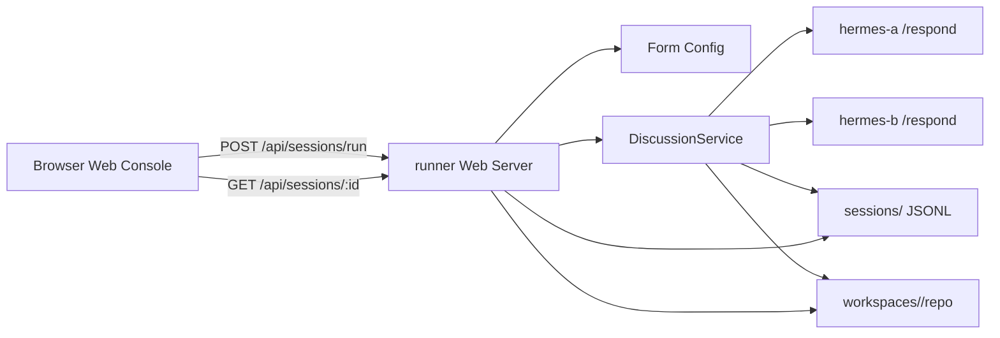

# Phase 3 Web Runner Console Visualization Design

## 1. 階段目標

Phase 3 的目標是讓使用者可以透過 Web 畫面直覺地操作 runner，並查看 Hermes planner / builder 的討論與 execution 結果。

本階段不是要取代 CLI，而是先建立一個 runner EC2 上的 Web console：

```text
Browser
→ runner Web server
→ DiscussionService
→ hermes-a / hermes-b HTTP wrapper
→ sessions/<sessionId> JSONL
→ Browser replay display
```

## 2. 階段拆分

### Phase 3A：Replay + Web Runner Form

Phase 3A 是 MVP，先做可操作、可回放的 Web runner console。

功能：

- 使用者在 Web 表單輸入 session topic。
- 使用者設定 maxRounds。
- 使用者設定 planner endpoint，也就是 hermes-a `/respond` URL。
- 使用者設定 builder endpoint，也就是 hermes-b `/respond` URL。
- 使用者選擇是否啟用 execution。
- 使用者按下 Run Session。
- runner Web server 建立等效的 `DiscussionRunnerConfig`。
- runner Web server 執行 `DiscussionService.createSession()` 與 `DiscussionService.runSession()`。
- session 完成後，Web 顯示完整 replay：
  - session summary
  - planner / builder 對話
  - task assignments
  - actions
  - execution results
  - workspace files

Phase 3A 不做真正即時串流。使用者按下 Run 後，可以看到 running 狀態；完成後載入 replay。

### Phase 3B：Live Monitor

Phase 3B 是下一階段，加入接近即時的監看能力。

功能：

- session 執行中即時顯示最新 message。
- action 產生時即時出現在 actions panel。
- execution result 完成時即時更新 succeeded / failed。
- runner 呼叫 hermes-a / hermes-b 時顯示目前 active speaker。

建議技術：

```text
Server-Sent Events (SSE)
```

先不使用 WebSocket，因為本系統初期是 runner 單向推送狀態給 browser，SSE 足夠且實作較簡單。

## 3. 使用情境

### 情境一：從 Web 啟動真實 Hermes session

使用者在 runner EC2 啟動 Web server：

```bash
npm run web
```

使用者打開：

```text
http://<runner-public-ip>:3000
```

在 Web 表單輸入：

```text
topic:
請 Hermes A 與 Hermes B 共同完成一個產品介紹網站 MVP 的最小可執行雛形。

maxRounds:
2

planner URL:
http://10.100.1.21:4101/respond

builder URL:
http://10.100.1.32:4102/respond

enableExecution:
true
```

按下 Run Session。

完成後，Web 顯示：

```text
sessionId
status
messageCount
roundsCompleted
taskAssignmentCount
executionResultCount
planner / builder conversation
actions.jsonl
execution-results.jsonl
workspace file list
```

### 情境二：查看既有 session replay

使用者開啟 Web console 後，在 session list 選擇過去 session。

Web server 從：

```text
sessions/<sessionId>/messages.jsonl
sessions/<sessionId>/actions.jsonl
sessions/<sessionId>/execution-results.jsonl
sessions/<sessionId>/result.json
```

載入 replay 畫面。

這讓使用者不需要 SSH 進 runner，也不需要手動 cat JSONL。

## 4. 技術選型

Phase 3A 使用同一個 TypeScript / Node 專案，不新增大型前端框架。

新增：

```text
src/web/server.ts
public/index.html
public/app.js
public/styles.css
```

`src/web/server.ts` 使用 Node built-in `http` module 即可。先不引入 Express，降低依賴與部署成本。

`public/` 使用原生 HTML / CSS / browser JavaScript。畫面以 operational dashboard 為主，不做 landing page。

新增 npm script：

```json
{
  "web": "npm run build && node dist/src/web/server.js"
}
```

可選環境變數：

```text
PORT=3000
HOST=0.0.0.0
SESSIONS_ROOT=sessions
WORKSPACES_ROOT=workspaces
```

## 5. 後端 API 設計

### GET /

回傳 Web app HTML。

### GET /api/default-config

回傳預設表單值。

Response：

```json
{
  "topic": "請 Hermes A 與 Hermes B 共同完成一個產品介紹網站 MVP 的最小可執行雛形。",
  "maxRounds": 2,
  "enableExecution": true,
  "workspaceRootDir": "workspaces",
  "rootDir": "sessions",
  "agents": [
    {
      "id": "hermes-a",
      "name": "Hermes A",
      "role": "planner",
      "type": "http",
      "url": "http://10.100.1.21:4101/respond",
      "timeoutMs": 300000
    },
    {
      "id": "hermes-b",
      "name": "Hermes B",
      "role": "builder",
      "type": "http",
      "url": "http://10.100.1.32:4102/respond",
      "timeoutMs": 300000
    }
  ]
}
```

來源可以是 `hermes-agents.real-execution.config.json`，若檔案不存在則回傳內建預設值。

### POST /api/sessions/run

建立並執行 session。

Request：

```json
{
  "topic": "string",
  "maxRounds": 2,
  "enableExecution": true,
  "agents": [
    {
      "id": "hermes-a",
      "name": "Hermes A",
      "role": "planner",
      "type": "http",
      "url": "http://10.100.1.21:4101/respond",
      "timeoutMs": 300000
    },
    {
      "id": "hermes-b",
      "name": "Hermes B",
      "role": "builder",
      "type": "http",
      "url": "http://10.100.1.32:4102/respond",
      "timeoutMs": 300000
    }
  ]
}
```

Response：

```json
{
  "sessionId": "uuid",
  "status": "completed",
  "messageCount": 2,
  "roundsCompleted": 1,
  "taskAssignmentCount": 2,
  "executionResultCount": 10
}
```

Phase 3A 可採同步等待 run 完成後回傳。若 session 執行時間過長，Phase 3B 再改成 background job + SSE。

### GET /api/sessions

列出既有 sessions。

Response：

```json
[
  {
    "sessionId": "uuid",
    "topic": "string",
    "status": "completed",
    "updatedAt": "2026-05-07T07:01:46.816Z",
    "messageCount": 2,
    "executionResultCount": 10
  }
]
```

資料來源：

```text
sessions/*/session.json
sessions/*/result.json
```

### GET /api/sessions/:sessionId

回傳 replay 所需的整包資料。

Response：

```json
{
  "session": {},
  "result": {},
  "messages": [],
  "actions": [],
  "executionResults": [],
  "workspaceFiles": []
}
```

### GET /api/sessions/:sessionId/messages

回傳 `messages.jsonl`。

### GET /api/sessions/:sessionId/actions

回傳 `actions.jsonl`。

### GET /api/sessions/:sessionId/execution-results

回傳 `execution-results.jsonl`。

### GET /api/sessions/:sessionId/result

回傳 `result.json`。

### GET /api/sessions/:sessionId/workspace-files

回傳 workspace repo 內檔案清單。

Response：

```json
[
  {
    "path": "docs/web-mvp-plan.md",
    "size": 1234
  },
  {
    "path": "web-mvp/index.html",
    "size": 5678
  }
]
```

安全限制：

- 只能讀取 `workspaces/<sessionId>/repo` 之內。
- 不提供任意 path query。
- Phase 3A 只列檔案，不提供檔案內容讀取 API。若需要預覽檔案內容，下一輪再加白名單式 endpoint。

## 6. 前端畫面設計

Phase 3A 第一版是一個 single-page operational dashboard。

### 6.1 Runner Control

位置：左側固定欄。

欄位：

- Topic textarea
- Max rounds input
- Planner URL input
- Builder URL input
- Enable execution toggle
- Run Session button
- Reset to default button

執行中狀態：

```text
Run button disabled
status shows Running
last started time visible
```

錯誤狀態：

```text
show red error banner
keep user input intact
```

### 6.2 Session Summary

位置：上方主區塊。

顯示：

- sessionId
- status
- roundsCompleted
- messageCount
- taskAssignmentCount
- executionResultCount
- workspace repo path

狀態色：

```text
completed: green
running: blue
failed: red
created: gray
```

### 6.3 Meeting Timeline

位置：中間主欄。

每則 message 顯示：

- sender name
- role
- round
- timestamp
- content
- message-level task assignments
- message-level actions
- message-level execution results

Planner / builder 用不同邊框色或 badge：

```text
planner: indigo badge
builder: teal badge
runner/system: neutral badge
```

### 6.4 Execution Panel

位置：右側欄。

顯示：

- actions list
- execution results list
- succeeded / failed / skipped count
- outputPreview
- error summary

每個 action / result 需能對應：

```text
agentId
actionId
type
status
summary
```

### 6.5 Workspace Files

位置：右側欄下半部或 timeline 下方 tab。

顯示：

- relative path
- size

Phase 3A 不預覽檔案內容，只列檔案。

## 7. 資料流



## 8. Error Handling

### 表單驗證

後端應拒絕：

- empty topic
- maxRounds < 1
- missing planner URL
- missing builder URL
- invalid URL
- duplicated agent id

前端也做基本驗證，但後端是最後防線。

### Session 執行錯誤

如果 hermes-a / hermes-b endpoint 失敗：

- API 回傳 HTTP 500
- response body 包含 error message
- Web 顯示錯誤 banner
- 若 session 已建立，仍可在 session list 看到 failed session

### JSONL 讀取錯誤

如果某個 session 檔案不存在：

- API 回傳 404
- Web 顯示「session data not found」

如果 JSONL 某行 parse 失敗：

- Phase 3A 可回傳 500
- 錯誤需包含 file name 與 line number

## 9. Security Boundaries

Phase 3A 假設 Web console 只在受控 runner EC2 環境使用。

仍需保留以下限制：

- Web API 不接受任意 filesystem path。
- sessionId 必須符合安全字元，例如 UUID-like 或 `[a-zA-Z0-9._-]+`。
- workspace files 只能列出 `workspaces/<sessionId>/repo`。
- `POST /api/sessions/run` 只支援 http agents，不支援任意 command agents。
- Phase 3A 不提供 Web UI 直接輸入 shell command。

後續若要開放給多人使用，需要增加：

```text
authentication
authorization
CSRF protection
rate limiting
audit log
```

這些不放入 Phase 3A MVP。

## 10. Testing Strategy

### Unit tests

新增測試：

- validate Web run request rejects empty topic。
- validate Web run request rejects invalid agent URL。
- sessionId path guard rejects path traversal。
- JSONL loader returns ordered records。
- workspace file listing stays inside workspace repo。

### Integration tests

新增測試：

- POST `/api/sessions/run` with mock http agents returns completed session。
- GET `/api/sessions/:sessionId` returns messages, actions, executionResults。
- GET `/api/sessions` lists completed sessions。

### Manual validation

在 runner EC2：

```bash
npm run web
```

Browser：

```text
http://<runner-public-ip>:3000
```

驗收：

- 可以填入 topic / endpoints。
- 可以按 Run Session。
- session 完成後看到 planner / builder 對話。
- 可以看到 actions 與 execution results。
- 可以看到 workspace file list。

## 11. MVP Out of Scope

Phase 3A 不做：

- 真正 live streaming。
- WebSocket。
- 多使用者權限。
- 編輯已存在 session。
- 直接在 Web 中修改 workspace file。
- 直接在 Web 中部署產物。
- 任意 shell command input。
- Agent credential 管理。
- GitHub PR 自動建立。

## 12. Phase 3B Extension Point

Phase 3B 可以在不改變 session semantics 的前提下增加：

```text
GET /api/sessions/:sessionId/stream
```

使用 SSE event：

```text
session.created
session.started
message.appended
action.appended
executionResult.appended
session.completed
session.failed
```

需要調整：

- `DiscussionService.runSession()` 支援 event callback。
- Web server 註冊 active session listeners。
- Frontend 用 `EventSource` 更新 timeline。

## 13. Completion Criteria

Phase 3A 完成標準：

- README 有 Web runner console 使用方式。
- `npm run web` 可啟動 server。
- Web 表單可啟動 real Hermes execution session。
- Web 可 replay session 對話、actions、execution results。
- Web 可列出 workspace files。
- `npm test` 全部通過。
- 新增 Phase 3A validation document，記錄 runner EC2 實測結果。

Phase 3B 完成標準：

- session 執行中 Web 會自動更新。
- 不需要手動 refresh 即可看到新 message / action / result。
- SSE reconnect 後能重新載入 session replay。

