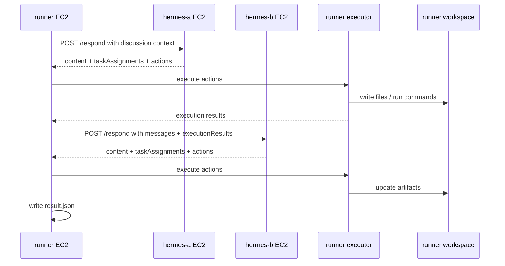

# Step 12：Phase 2 真實 Hermes Execution MVP 驗證結案紀錄

## 1. 階段定位

本文件記錄 Phase 2 Execution MVP 的完整驗證結果。

Phase 1 已完成：

```text
runner
→ hermes-a / hermes-b real Hermes wrapper
→ 真實 Hermes 多輪討論
→ messages.jsonl / result.json
```

Phase 2 本次完成：

```text
runner
→ hermes-a / hermes-b real Hermes wrapper
→ 真實 Hermes 產生 JSON actions
→ runner executor 執行 actions
→ actions.jsonl / execution-results.jsonl / workspace artifacts
→ result.json 產生任務分派
```

本階段的核心結論：

```text
真實 Hermes agents 已可在三台 EC2 架構下進行討論，
並產生可由 runner 執行的 actions。
```

## 2. 驗證日期

```text
date: 2026-05-07
timezone: Asia/Taipei
```

## 3. EC2 角色與位址

```text
runner:
  hostname: ip-10-100-1-11
  role: moderator / scheduler / executor
  repo path: /home/ubuntu/projects/aiMeeting

hermes-a:
  hostname: ip-10-100-1-21
  role: planner
  endpoint: http://10.100.1.21:4101/respond
  health: http://10.100.1.21:4101/health

hermes-b:
  hostname: ip-10-100-1-32
  role: builder
  endpoint: http://10.100.1.32:4102/respond
  health: http://10.100.1.32:4102/health
```

## 4. 驗證架構



## 5. 使用版本

Repository 最新驗證 commit：

```text
bac8dd7 add-real-hermes-wrapper-health
```

Hermes CLI：

```text
Hermes Agent v0.12.0 (2026.4.30)
Project: /home/ubuntu/.hermes/hermes-agent
Python: 3.11.15
OpenAI SDK: 2.33.0
```

Real wrapper：

```text
real-hermes-wrapper-action-json-v3
```

## 6. 重要修正紀錄

### 6.1 Hermes CLI prompt 參數修正

原本文件使用：

```bash
hermes chat "請用繁體中文簡短回答：Hermes A 可以正常回覆嗎？"
```

實際 Hermes Agent v0.12.0 會回：

```text
hermes: error: unrecognized arguments
```

修正為：

```bash
hermes -z "請用繁體中文簡短回答：Hermes A 可以正常回覆嗎？" chat
```

### 6.2 real wrapper actions 解析修正

第一次 Phase 2 real execution session 結果：

```text
status: completed
executionResultCount: 0
```

根因：

```text
agents/hermes-http-real.js 只把 Hermes stdout 包成 content，
沒有解析 JSON，也沒有回傳 actions 給 runner。
```

修正：

```text
wrapper prompt 要求 Hermes 只輸出 JSON object。
wrapper 解析 Hermes stdout 中的 JSON。
wrapper 回傳 content / taskAssignments / actions。
runner 收到 actions 後交給 executor 執行。
```

### 6.3 health endpoint 與診斷 log

為避免不確定 hermes-a / hermes-b 是否仍在跑舊 process，新增：

```text
GET /health
```

成功回覆：

```json
{
  "ok": true,
  "wrapperVersion": "real-hermes-wrapper-action-json-v3"
}
```

wrapper 每次回覆後會輸出：

```json
{
  "event": "respond.completed",
  "wrapperVersion": "real-hermes-wrapper-action-json-v3",
  "actionCount": 3
}
```

## 7. Health 驗證結果

hermes-a 本機：

```bash
curl -s http://localhost:4101/health
```

結果：

```json
{
  "ok": true,
  "wrapperVersion": "real-hermes-wrapper-action-json-v3",
  "agentId": "hermes-a",
  "agentName": "Hermes A",
  "agentRole": "planner",
  "port": 4101
}
```

hermes-b 本機：

```bash
curl -s http://localhost:4102/health
```

結果：

```json
{
  "ok": true,
  "wrapperVersion": "real-hermes-wrapper-action-json-v3",
  "agentId": "hermes-b",
  "agentName": "Hermes B",
  "agentRole": "builder",
  "port": 4102
}
```

runner 連 hermes-a private IP：

```bash
curl -s "http://${HERMES_A_PRIVATE_IP}:4101/health"
```

結果：

```json
{
  "ok": true,
  "wrapperVersion": "real-hermes-wrapper-action-json-v3",
  "agentId": "hermes-a",
  "agentName": "Hermes A",
  "agentRole": "planner",
  "port": 4101
}
```

runner 連 hermes-b private IP：

```bash
curl -s "http://${HERMES_B_PRIVATE_IP}:4102/health"
```

結果：

```json
{
  "ok": true,
  "wrapperVersion": "real-hermes-wrapper-action-json-v3",
  "agentId": "hermes-b",
  "agentName": "Hermes B",
  "agentRole": "builder",
  "port": 4102
}
```

結論：

```text
runner 連到的 hermes-a / hermes-b 都是新版 v3 wrapper。
```

## 8. 成功 session

runner 執行：

```bash
npm run session -- --config hermes-agents.real-execution.config.json --execute
```

成功 session：

```text
sessionId: d9377c90-a800-401d-8029-f1ba3793ea95
status: completed
messageCount: 2
roundsCompleted: 1
taskAssignmentCount: 2
executionResultCount: 10
```

輸出檔案：

```text
sessions/d9377c90-a800-401d-8029-f1ba3793ea95/messages.jsonl
sessions/d9377c90-a800-401d-8029-f1ba3793ea95/events.jsonl
sessions/d9377c90-a800-401d-8029-f1ba3793ea95/session.json
sessions/d9377c90-a800-401d-8029-f1ba3793ea95/result.json
sessions/d9377c90-a800-401d-8029-f1ba3793ea95/actions.jsonl
sessions/d9377c90-a800-401d-8029-f1ba3793ea95/execution-results.jsonl
```

Workspace：

```text
/home/ubuntu/projects/aiMeeting/workspaces/d9377c90-a800-401d-8029-f1ba3793ea95
/home/ubuntu/projects/aiMeeting/workspaces/d9377c90-a800-401d-8029-f1ba3793ea95/repo
```

## 9. 本次討論主題

```text
請 Hermes A 與 Hermes B 共同完成一個產品介紹網站 MVP 的最小可執行雛形。
Hermes A 負責規劃，Hermes B 負責產生可執行 actions。
請先建立 docs/web-mvp-plan.md，內容包含網站目標、頁面區塊、
技術選型、開發任務與驗收標準。
接著用 run_command 檢查 docs 目錄。
```

## 10. 最終任務分派

Hermes B：

```text
title:
依 MVP 規劃建立可執行產品介紹網站雛形

detail:
根據 docs/web-mvp-plan.md 的規劃，建立最小可執行網站結構，
優先完成首頁靜態內容、CTA、特色區塊、產品截圖佔位、
價格或方案摘要、常見問題與聯絡入口，
並提供可本機啟動與驗收的 actions。

dependency:
docs/web-mvp-plan.md 已建立並通過 docs 目錄檢查

confidence:
0.86
```

Hermes A：

```text
title:
依規劃文件執行 MVP 雛形驗收檢查

detail:
請依 docs/web-mvp-plan.md 的驗收標準，
檢查 web-mvp/index.html 是否完整涵蓋 Hero 與 CTA、
特色區塊、產品截圖佔位、價格/方案摘要、FAQ、聯絡入口；
並確認可用 node 或 npm 指令本機預覽。

dependency:
hermes-b 已建立 web-mvp 基礎檔案

confidence:
0.88
```

## 11. 驗收結果

本階段成功條件與結果：

| 驗收項目 | 結果 |
| --- | --- |
| hermes-a wrapper 正常啟動 | 通過 |
| hermes-b wrapper 正常啟動 | 通過 |
| runner 可連 hermes-a `/health` | 通過 |
| runner 可連 hermes-b `/health` | 通過 |
| wrapper version 為 v3 | 通過 |
| runner 執行 real execution config | 通過 |
| session status 為 completed | 通過 |
| 真實 Hermes 產生 messages | 通過 |
| 真實 Hermes 產生 actions | 通過 |
| runner executor 執行 actions | 通過 |
| executionResultCount 大於 0 | 通過，結果為 10 |
| result.json 產生 task assignments | 通過 |

## 12. 建議人工複查指令

在 runner EC2：

```bash
SESSION_ID=d9377c90-a800-401d-8029-f1ba3793ea95

cat "sessions/${SESSION_ID}/actions.jsonl"
cat "sessions/${SESSION_ID}/execution-results.jsonl"
cat "sessions/${SESSION_ID}/result.json"
find "workspaces/${SESSION_ID}/repo" -maxdepth 4 -type f -print
cat "workspaces/${SESSION_ID}/repo/docs/web-mvp-plan.md"
```

若 Hermes B 建立了網站檔案：

```bash
find "workspaces/${SESSION_ID}/repo/web-mvp" -maxdepth 4 -type f -print
cat "workspaces/${SESSION_ID}/repo/web-mvp/index.html"
```

## 13. 階段結論

Phase 2 Execution MVP 可視為完成。

已證明：

```text
多台真實 Hermes agents 可以在 runner 控制下共同討論，
並透過 JSON actions 讓 runner 在隔離 workspace 內執行任務。
```

目前能力邊界：

```text
- runner 是唯一 executor。
- hermes-a / hermes-b 不直接互相通訊。
- agents 透過 runner 傳入的 context、messages、executionResults 進行協作。
- actions 以檔案操作與 allowlisted command 為主。
- workspace artifacts 先保留在 runner 本機。
```

## 14. 下一階段建議

Phase 3 可聚焦：

```text
1. 強化 action schema 驗證與錯誤回饋。
2. 讓 failed execution results 能引導 Hermes 自動修正。
3. 增加 artifact summary，讓 runner 結案時列出建立了哪些檔案。
4. 增加 per-agent execution policy，例如 planner 只能讀取與分派，builder 才能寫入。
5. 增加 long-running session resume，讓 Hermes 可以延續前一個 session。
6. 將 workspace artifacts 打包或同步到 GitHub branch / PR。
```

建議下一個最小驗證：

```text
讓 Hermes B 產生一個更完整的 web-mvp，
runner 執行 actions 後，
Hermes A 根據 executionResults 與檔案內容做驗收，
如果缺漏，再由 Hermes B 產生修正 actions。
```

