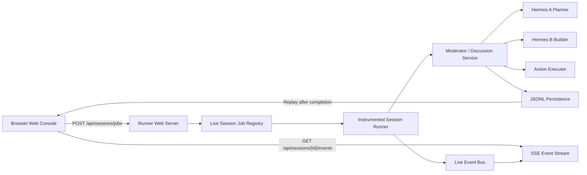

# Phase 3B Live Monitor Design

## Purpose

Phase 3B upgrades the Phase 3A Web Runner Console from run-and-replay to live monitoring.

In Phase 3A, the browser starts a session and waits until the runner finishes. After completion, the browser loads persisted session records and renders the replay.

In Phase 3B, the browser starts a session as a background job and subscribes to runner-side live events. The user can see the current session status, active speaker, messages, actions, and execution results while the session is still running. The existing replay behavior remains available after completion.

## Current Baseline

The current `v0.2.1` system provides:

- A Node HTTP Web server under `src/web/server.ts`.
- Static frontend assets under `public/`.
- Web request validation under `src/web/validation.ts`.
- Web handlers under `src/web/handlers.ts`.
- Replay reading under `src/web/session-reader.ts`.
- Synchronous Web run flow through `POST /api/sessions/run`.
- Replay API through `GET /api/sessions/:sessionId`.
- Endpoint health checks through `POST /api/agents/check`.

Phase 3B should preserve those capabilities and add live monitoring without changing the underlying session semantics.

## Recommended Approach

Use Background Job + Server-Sent Events.

The browser will create a session job, receive a `sessionId` immediately, then subscribe to live events for that session.



Server-Sent Events are sufficient because the browser only needs runner-to-browser updates in Phase 3B. WebSocket would add bidirectional protocol complexity before the product needs it.

## Goals

- Start real Hermes sessions from the Web console without blocking the browser until completion.
- Show live session lifecycle updates: queued, running, completed, failed.
- Show active speaker while the runner is calling Hermes A or Hermes B.
- Append planner and builder messages to the timeline as they are produced.
- Append actions and execution results to the UI as they are produced.
- Preserve Phase 3A replay behavior for completed or partially completed sessions.
- Keep all persistence append-only through the existing JSONL/session files.
- Keep v1 remote agent support through the existing HTTP wrapper model.

## Non-Goals

Phase 3B does not include:

- WebSocket support.
- Multi-user collaborative editing.
- Web UI shell command input.
- Pause, resume, or cancel job controls.
- Durable background jobs after runner process restart.
- SSE event id cursor replay.
- Database persistence.
- Authentication or authorization.
- Direct editing of workspace files from the browser.

These are candidates for Phase 3C or production hardening.

## User Experience

The existing Web Runner Console remains the main screen.

When the user clicks Run Session:

1. The browser validates the visible fields as it does today.
2. The browser calls `POST /api/sessions/jobs`.
3. The server immediately returns `sessionId`, `status`, and `eventsUrl`.
4. The UI switches to live mode for that session.
5. The UI opens an `EventSource` connection to `eventsUrl`.
6. The status banner changes as events arrive.
7. The active speaker area shows which agent is currently being called.
8. The meeting timeline appends messages as the runner records them.
9. The execution panel appends action and result updates.
10. When `session.completed` or `session.failed` arrives, the UI closes the live stream and loads replay for the final persisted state.

The Sessions list remains available. If the user selects an old session, the UI loads replay through the existing API.

## API Design

### Create Background Job

```text
POST /api/sessions/jobs
```

Request body uses the current Phase 3A Web run request shape:

```json
{
  "topic": "請 Hermes A 與 Hermes B 共同完成一個產品介紹網站 MVP。",
  "maxRounds": 2,
  "enableExecution": true,
  "agents": [
    {
      "id": "hermes-a",
      "name": "Hermes A",
      "role": "planner",
      "type": "http",
      "url": "http://10.100.1.21:4101/respond",
      "timeoutMs": 300000
    },
    {
      "id": "hermes-b",
      "name": "Hermes B",
      "role": "builder",
      "type": "http",
      "url": "http://10.100.1.32:4102/respond",
      "timeoutMs": 300000
    }
  ]
}
```

Response:

```json
{
  "sessionId": "1c6b42a5-f08e-41d7-a7b1-8f4d4cf573e2",
  "status": "queued",
  "eventsUrl": "/api/sessions/1c6b42a5-f08e-41d7-a7b1-8f4d4cf573e2/events"
}
```

Validation should reuse the existing `validateRunSessionRequest()` behavior.

### Subscribe to Live Events

```text
GET /api/sessions/:sessionId/events
```

The response is `text/event-stream`.

Example stream:

```text
event: session.started
data: {"sessionId":"1c6b42a5-f08e-41d7-a7b1-8f4d4cf573e2","status":"running"}

event: speaker.active
data: {"sessionId":"1c6b42a5-f08e-41d7-a7b1-8f4d4cf573e2","agentId":"hermes-a","agentName":"Hermes A","role":"planner"}

event: message.appended
data: {"sessionId":"1c6b42a5-f08e-41d7-a7b1-8f4d4cf573e2","message":{"senderId":"hermes-a","senderName":"Hermes A","senderRole":"planner","round":1,"content":"..."}}

event: action.created
data: {"sessionId":"1c6b42a5-f08e-41d7-a7b1-8f4d4cf573e2","action":{"type":"write_file","path":"docs/web-mvp-plan.md"}}

event: execution.result
data: {"sessionId":"1c6b42a5-f08e-41d7-a7b1-8f4d4cf573e2","result":{"status":"succeeded","summary":"Wrote docs/web-mvp-plan.md"}}

event: session.completed
data: {"sessionId":"1c6b42a5-f08e-41d7-a7b1-8f4d4cf573e2","status":"completed"}
```

### Existing APIs

Keep these APIs:

- `POST /api/sessions/run`
- `GET /api/sessions`
- `GET /api/sessions/:sessionId`
- `POST /api/agents/check`

`POST /api/sessions/run` can remain synchronous for compatibility and local testing. The Web UI should move to `POST /api/sessions/jobs`.

## Live Event Model

Create a small event model for live Web updates.

```ts
export type LiveSessionStatus = "queued" | "running" | "completed" | "failed";

export type LiveSessionEventType =
  | "session.queued"
  | "session.started"
  | "speaker.active"
  | "message.appended"
  | "action.created"
  | "execution.result"
  | "session.completed"
  | "session.failed";

export interface LiveSessionEvent<TData = unknown> {
  id: string;
  sessionId: string;
  type: LiveSessionEventType;
  createdAt: string;
  data: TData;
}
```

Use event objects internally, then format them as SSE at the HTTP boundary.

## Components

### `LiveEventBus`

Responsibility:

- Manage subscribers per session.
- Publish live events to all subscribers for a session.
- Remove subscribers when HTTP clients disconnect.

Expected API:

```ts
export type LiveEventSubscriber = (event: LiveSessionEvent) => void;

export class LiveEventBus {
  publish(event: LiveSessionEvent): void;
  subscribe(sessionId: string, subscriber: LiveEventSubscriber): () => void;
  subscriberCount(sessionId: string): number;
}
```

The event bus is in-memory only. JSONL persistence remains the durable record.

### `LiveSessionJobRegistry`

Responsibility:

- Create and track background session jobs.
- Expose job state to the Web server and tests.
- Publish lifecycle events through `LiveEventBus`.
- Run the existing session flow in the background.

Expected job shape:

```ts
export interface LiveSessionJob {
  sessionId: string;
  status: "queued" | "running" | "completed" | "failed";
  topic: string;
  createdAt: string;
  startedAt?: string;
  completedAt?: string;
  error?: string;
}
```

Expected API:

```ts
export class LiveSessionJobRegistry {
  createJob(request: WebRunSessionRequest): LiveSessionJob;
  getJob(sessionId: string): LiveSessionJob | undefined;
  listJobs(): LiveSessionJob[];
}
```

Implementation detail: `createJob()` should schedule the actual run asynchronously and return immediately.

### `InstrumentedDiscussionRunner`

Responsibility:

- Execute the existing session logic.
- Emit live events at the points where the runner already knows useful state.
- Avoid duplicating session semantics.

The implementation can either wrap `DiscussionService` or add optional lifecycle hooks to the existing moderator/service path. The preferred implementation is to add explicit hooks where the existing flow appends messages, actions, and execution results. That keeps persisted records and live events consistent.

Suggested hooks:

```ts
export interface DiscussionLifecycleHooks {
  onSessionStarted?(sessionId: string): void | Promise<void>;
  onSpeakerActive?(context: { sessionId: string; agentId: string; agentName: string; role?: string; round: number }): void | Promise<void>;
  onMessageAppended?(message: DiscussionMessage): void | Promise<void>;
  onActionCreated?(context: { sessionId: string; action: ExecutionAction }): void | Promise<void>;
  onExecutionResult?(context: { sessionId: string; result: ExecutionResult }): void | Promise<void>;
  onSessionCompleted?(sessionId: string): void | Promise<void>;
  onSessionFailed?(context: { sessionId: string; error: string }): void | Promise<void>;
}
```

If adding hooks to the existing service would create excessive coupling, a focused live runner wrapper is acceptable. The invariant is that live events should correspond to actual persisted session records.

## Frontend Design

The frontend remains plain HTML/CSS/JavaScript.

Add or update UI state:

```js
const state = {
  defaultConfig: undefined,
  selectedSessionId: undefined,
  liveSource: undefined,
  liveStatus: undefined,
  activeSpeaker: undefined
};
```

Expected frontend behavior:

- `runSession()` calls `/api/sessions/jobs` instead of `/api/sessions/run`.
- `connectLiveEvents(sessionId, eventsUrl)` opens an `EventSource`.
- Event handlers update existing render targets incrementally.
- On terminal events, close the EventSource and call `loadReplay(sessionId)`.
- Selecting another session closes any current live EventSource to avoid mixing streams.

UI additions:

- Live status indicator near the status banner.
- Active speaker indicator above the timeline.
- Optional event log count for troubleshooting.

Do not introduce a frontend framework in Phase 3B.

## Error Handling

### Hermes endpoint failure

If a Hermes wrapper cannot be reached or returns an error, the job should:

- Persist whatever records already exist.
- Publish `session.failed`.
- Mark the job as `failed`.
- Include a readable error message in the live event and status banner.

### Browser disconnect

If the browser disconnects:

- The job continues running.
- The SSE subscriber is removed.
- The user can reload the page and select the session from the Sessions list.

### Browser reconnect

Phase 3B does not implement SSE event id replay.

Reconnect strategy:

- Frontend may call replay API to reload current persisted state.
- Frontend may open a new SSE connection if the job is still running.

### Runner restart

In-memory jobs and subscribers are lost.

Persisted JSONL/session files remain readable through replay. This is acceptable for Phase 3B.

## Testing Strategy

### Unit Tests

- `LiveEventBus` publishes events to one subscriber.
- `LiveEventBus` publishes events to multiple subscribers.
- `LiveEventBus` unsubscribe stops future delivery.
- `LiveSessionJobRegistry` creates queued jobs.
- `LiveSessionJobRegistry` transitions jobs to running and completed for a mock runner.
- `LiveSessionJobRegistry` transitions jobs to failed when the runner throws.
- SSE formatter renders valid `event:` and `data:` records.

### Server Tests

- `POST /api/sessions/jobs` returns `sessionId`, `queued`, and `eventsUrl`.
- `GET /api/sessions/:sessionId/events` returns `text/event-stream`.
- SSE endpoint receives a published event for the subscribed session.
- SSE endpoint does not leak events from another session.

### Integration Tests

- Start a job with deterministic mock agents.
- Subscribe to the live stream.
- Verify the stream includes `session.started`, `speaker.active`, `message.appended`, and `session.completed`.
- Verify completed replay still returns the persisted transcript.

### Web Smoke

- Start Web server.
- Open browser to the console.
- Click Run Session with mock or local endpoints.
- Confirm the UI enters live mode.
- Confirm messages appear before completion.
- Confirm completed replay still loads.

## Rollout Plan

Phase 3B should be released as `v0.3.0` because it changes the Web runner execution model from synchronous to background-job-based live monitoring.

Recommended implementation order:

1. Add live event types and SSE formatting tests.
2. Add `LiveEventBus`.
3. Add `LiveSessionJobRegistry` with mock runner tests.
4. Add lifecycle hooks or an instrumented runner.
5. Add `POST /api/sessions/jobs`.
6. Add `GET /api/sessions/:sessionId/events`.
7. Update frontend run flow to use jobs and EventSource.
8. Update docs and changelog.
9. Run local and EC2 validation.

## Acceptance Criteria

Phase 3B is complete when:

- Web users can start a session and receive a `sessionId` immediately.
- Web users can see live active speaker updates.
- Web users can see messages appear while the session is still running.
- Web users can see action and execution result updates while the session is still running.
- Completed sessions remain visible through replay.
- Existing Phase 3A replay APIs still work.
- Tests cover event bus, job registry, SSE endpoint, and live mock integration.
- A validation document records local or EC2 live monitor verification.

